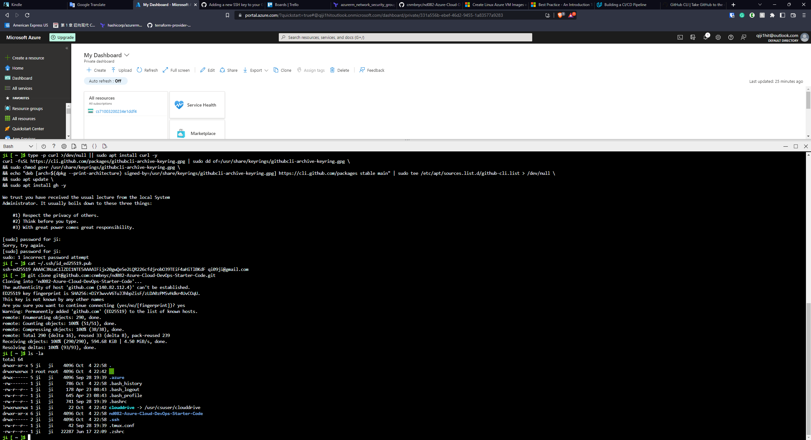

# Overview


1. A simple Flask server, with a working endpoint `/predict`, and `/healthcheck`.
1. The `/predict` endpoint can predict the average Boston house price.
1. Hosted using Azure Pipeline and Azure App Service.
1. Not that stable for free-tier users. So please upgrade to `Standard` ASAP.

## Project Plan


* A link to a Trello board for the project
[Trello board link](https://trello.com/invite/b/wtPiIEEs/e6edf332030f4463b3172efb288fa174/web-app-not-free-project)

* A link to a spreadsheet that includes the original and final project plan>
[Spreadsheet link](https://docs.google.com/spreadsheets/d/1wR_a4RVaV_Ui7uC1DCI6BPzD6F1egTSK/edit?usp=sharing&ouid=102356077519799393882&rtpof=true&sd=true)

## Instructions

[Link to the Diagram](https://lucid.app/lucidchart/70aef74f-e955-4a20-b072-ad062e4acbc3/edit?viewport_loc=-11%2C-144%2C3072%2C1455%2C0_0&invitationId=inv_d195e482-2f49-4b93-8dbc-dafe69047d01#https://lucid.app/lucidchart/70aef74f-e955-4a20-b072-ad062e4acbc3/edit?invitationId=inv_d195e482-2f49-4b93-8dbc-dafe69047d01#)


* Project running on Azure App Service

1. The Flask app is run in Azure using Azure App Service, which is a `PaSS`.


* Project cloned into Azure Cloud Shell

1. First step, clone the repo using Azure Shell, which is easy after setting up the SSH correctly.



* Passing tests that are displayed after running the `make all` command from the `Makefile`

1. Then, SSH'd into the repo and run `make all` including Dependency Installation, Lint and Test.


* Output of a test run

1. `make test` passed all the test cases.


* Successful deploy of the project in Azure Pipelines.  [Note the official documentation should be referred to and double checked as you setup CI/CD](https://docs.microsoft.com/en-us/azure/devops/pipelines/ecosystems/python-webapp?view=azure-devops).

1. After a few clicks, deployment through Azure Pipelines could be done.
1. The difficult part is, you need to fill in a Google Form to request a free parallel, which is totally a disaster.
1. And if you survived the disaster, everything will be good to go.


* Running Azure App Service from Azure Pipelines automatic deployment

1. After Azure Pipelines (kinda like Github Actions) passed all the steps, inside the Azure App Service, the deployment success will be shown.


* Successful prediction from deployed flask app in Azure Cloud Shell.  [Use this file as a template for the deployed prediction](https://github.com/udacity/nd082-Azure-Cloud-DevOps-Starter-Code/blob/master/C2-AgileDevelopmentwithAzure/project/starter_files/flask-sklearn/make_predict_azure_app.sh).
The output should look similar to this:

```bash
udacity@Azure:~$ ./make_predict_azure_app.sh
Port: 443
{"prediction":[20.35373177134412]}
```

1. This one is HARD, because the package versions provided inside the Starter Kit is not working, need to manually fine-tune it to make the code working.
1. Some newer versions of Scikit-learn totally not working for this app.


* Output of streamed log files from deployed application

1. Like the local Docker running, you can call the API endpint and check the streamed logs at the meantime, which is easier for debug.


* Load testing using Locust


## Enhancements

1. Use Kubernetes to better orchestrate the service.
1. Add validation on the APIs request.
1. Integrate with 3rd party Data Source service.
1. Add auto-scale and rate-limiter to the service.

## Demo

[Demo Youtube Link](https://youtu.be/o1JGPqI-4lY)
